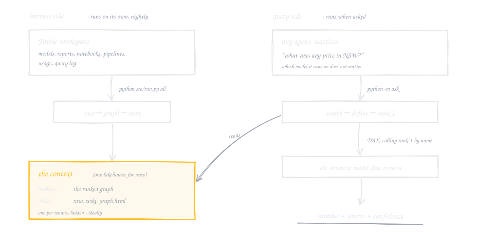

# fabric-context-layer

*A proof of concept, written to learn how a context layer works. Not a product, not
official, not supported.*

Ask three semantic models what *average price* is and you get three answers. This harvests
a Microsoft Fabric tenant, finds every definition of every business term, and ranks them
the way web search ranks pages. **[See it on a real tenant](https://djouallah.github.io/fabric-context-layer/)**:
a term ringed in red is defined two ways; click it to see which won and the DAX behind it.

## The core idea

A context layer sits above the semantic models and the data. It harvests the metadata a
tenant already has - models, reports, notebooks, pipelines, usage - into a knowledge graph
of what each term means, who defines it, who uses it, what feeds it. Call it an automatic
ontology; nobody authors it. Conflicting definitions are ranked on authority, popularity,
relevance and freshness.

An agent reads that context instead of the raw metadata. The agent is stateless and the
model behind it does not matter: the ranking happened before the question, so any agent
that can run a command line gets the same rank 1 and runs the same measure. The value is
in the context, not the agent.

It is only as good as the models under it. No measure, no definition; a measure nobody
documented, endorsed or used gives the ranking nothing to weigh. It goes on top of solid
semantic models, not around them.

## The ranking

Measure names normalise to terms (`Average Price`, `Price_AVG`, `Avg Price` are one term).
Two measures on one term with different DAX is a conflict; every definition is scored:

| signal | weight | from |
|---|---|---|
| authority | 2.0 | certified 2, promoted 1; +0.5 documented; +0.5 in a model, not a report |
| popularity | 1.5 | `ln(1 + opens of its reports + query-log evaluations + its model's opens, queries, refreshes)`, over 28 days |
| relevance | 1.0 | `ln(1 + reports) + 0.25 ln(1 + visuals)`; +0.5 exact name |
| freshness | 0.5 | `exp(-days since the owner changed / 180)` |

Rank 1 is the definition; a number is always rank 1 run by name on its own model, never
re-derived. Weights are hand-picked, in `src/graph.py`. **Rank is not correctness** - a
popular, certified, wrong definition still wins, and every answer to a conflicting term
says so in one line.

## How it works

The harvest runs nightly on its own. An agent asks whenever. They meet at the context and
never call each other.

<picture>
  <source media="(prefers-color-scheme: dark)" srcset="docs/how-it-works-dark.svg">
  
</picture>

The context is not another item. There is one per tenant, ranked per domain, built by the
platform and hidden; an agent never needs its address. This POC keeps it in a lakehouse
because that is the durable store it can write to, and `context.json` stands in for
discovery. The repo holds code, no data: one Python file per harvest step, a two-table
graph, the ranking in one SQL statement. It is meant to be read.

Running it, the nightly refresh, what is harvested, the schema, the limits: **[run.md](run.md)**.

## Licence

MIT - see [LICENSE](LICENSE).
